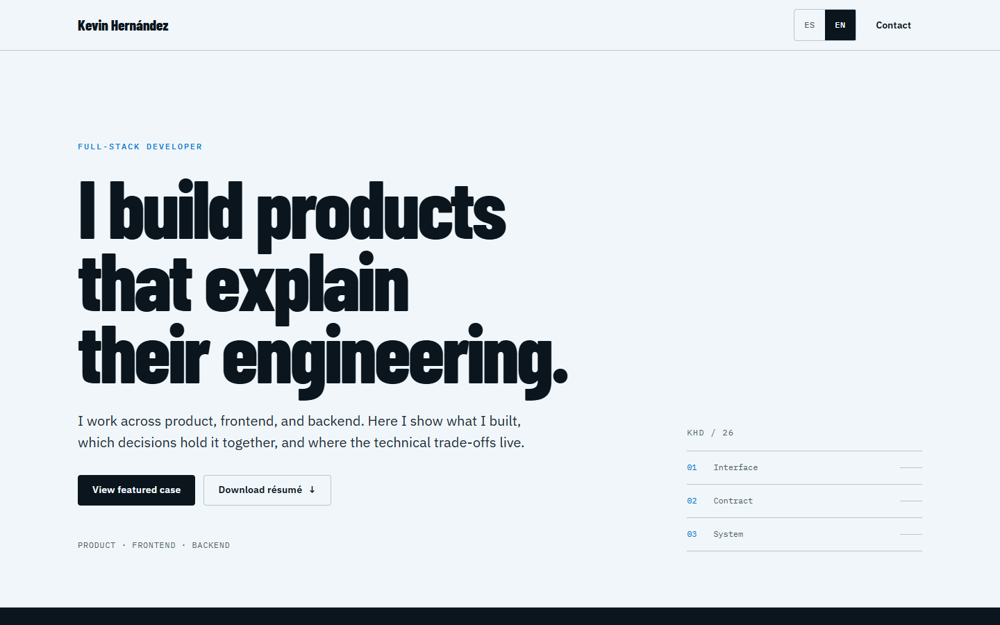
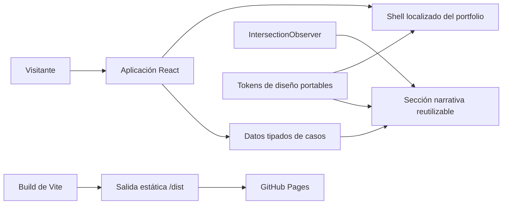

# Kevin Hernández — Portfolio

[English version](./README.md)

[](https://github.com/kevin0018/portfolio/actions/workflows/deploy.yml)

Un portfolio basado en evidencias que presenta proyectos full-stack como casos
de ingeniería: qué resuelve el producto, qué fronteras lo sostienen y dónde
viven sus decisiones técnicas importantes.

[Ver portfolio](https://kevin0018.github.io/portfolio/) ·
[Descargar CV](./public/assets/files/CV_Kevin_Hernandez_Deras.pdf)

[](https://kevin0018.github.io/portfolio/)

## Puntos destacados

- Lee el sitio como un único documento nativo, sin interceptar rueda ni gestos.
- Cambia entre español e inglés con detección del navegador y preferencia manual
  persistida.
- Sigue las decisiones de cada proyecto mediante una historia lineal mobile-first
  o una evidencia sticky en pantallas grandes.
- Revisa casos verificados de
  [wikiLoL](https://github.com/kevin0018/wikiLoL) y
  [Blog de Viajes](https://github.com/kevin0018/Blog-de-Viajes).
- Abre cada producto, repositorio, CV y vía de contacto desde la página.
- Usa la interfaz con foco visible, objetivos mínimos de 44px y un modo específico
  de movimiento reducido.

## Arquitectura



El modelo de contenido está separado de la presentación. Cada proyecto aporta
su narrativa localizada, enlaces, stack, etiquetas del flujo y evidencia visual
a un único componente reutilizable. JavaScript solo identifica el paso activo;
el documento no depende de control del scroll ni de animaciones.

### Decisiones que merece la pena revisar

- El scroll nativo sustituye el anterior cambio de vista disparado por la rueda.
- En móvil cada captura permanece junto a su explicación; el sticky aparece solo
  cuando existe suficiente espacio horizontal.
- `IntersectionObserver` actualiza la traza activa sin manejar eventos de rueda,
  toque o teclado.
- URLs y recursos locales respetan `BASE_URL`, manteniendo consistentes el entorno
  local y el despliegue de GitHub Pages bajo `/portfolio/`.
- El idioma parte del navegador y guarda únicamente la preferencia explícita
  `es` o `en` en local storage.
- Una capa portable de tokens OKLCH define color, tipografía, espacio, tiempos,
  reglas y tipografía responsive al margen de las utilidades de Tailwind.
- `prefers-reduced-motion` elimina el scroll suave y las transiciones espaciales.

## Stack

- **Aplicación:** React 19 y TypeScript 6
- **Build:** Vite 8
- **Interfaz:** Tailwind CSS 4 y sistema CSS propio basado en tokens
- **Contenido:** módulos tipados y bilingües de casos de estudio
- **Interacción:** anclas nativas e `IntersectionObserver`
- **Entrega:** pnpm 11, GitHub Actions y GitHub Pages

## Estructura del proyecto

```text
portfolio/
├── .github/workflows/        # Despliegue verificado a Pages
├── docs/                     # Planificación y preview del repositorio
├── public/assets/            # CV y capturas reales de proyectos
├── src/components/           # Shell y secciones narrativas reutilizables
├── src/data/                 # Casos tipados y bilingües
├── design.md                 # Dirección visual y de interacción bloqueada
├── tokens.css                # Tokens de diseño portables
├── package.json
└── vite.config.ts
```

Los componentes anteriores permanecen en el repositorio mientras termina el
rediseño, pero la entrada activa ya utiliza el nuevo shell de casos de estudio.

## Desarrollo local

Requisitos:

- Node.js 22.13 o posterior
- pnpm 11

```bash
git clone https://github.com/kevin0018/portfolio.git
cd portfolio
pnpm install --frozen-lockfile
pnpm dev
```

Vite sirve el proyecto con la misma ruta base que producción:

```text
http://localhost:5173/portfolio/
```

## Comandos

```bash
pnpm dev      # Inicia el servidor de desarrollo
pnpm lint     # Ejecuta ESLint
pnpm build    # Comprueba tipos y genera producción
pnpm preview  # Previsualiza la salida de producción
pnpm deploy   # Fallback manual con gh-pages
```

## Despliegue

Cada push a `master` instala el lockfile congelado, ejecuta lint y build, y
publica `dist/` mediante GitHub Pages. El workflow también puede iniciarse
manualmente desde GitHub Actions.

El repositorio debe usar **GitHub Actions** como origen de Pages. El comando
manual `pnpm deploy` permanece como fallback de compatibilidad.

## Atribución

La vista previa contiene capturas de proyectos propios de Kevin. Las imágenes
de League of Legends que aparecen dentro de wikiLoL pertenecen a Riot Games.
wikiLoL es un proyecto educativo no comercial y no está afiliado, respaldado ni
patrocinado por Riot Games.
