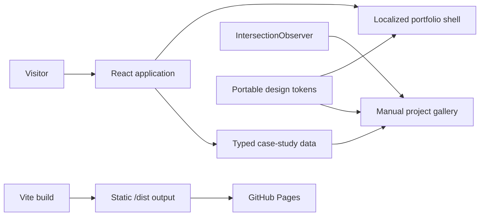

# Kevin Hernández — Portfolio

[Versión en español](./README.es.md)

[](https://github.com/kevin0018/portfolio/actions/workflows/deploy.yml)

An evidence-led portfolio that presents full-stack projects as engineering case
studies: what the product solves, which boundaries support it, and where the
important technical decisions live.

[Live portfolio](https://kevin0018.github.io/portfolio/) ·
[Download résumé](./public/assets/files/CV_Kevin_Hernandez_Deras.pdf)

[](https://kevin0018.github.io/portfolio/)

## Highlights

- Read the site as one native document without wheel or touch interception.
- Switch between English and Spanish with browser detection and a persisted
  manual preference.
- Explore each project through a manual screenshot gallery, short product
  descriptions, and optional technical details.
- Inspect verified case studies for
  [wikiLoL](https://github.com/kevin0018/wikiLoL),
  [Blog de Viajes](https://github.com/kevin0018/Blog-de-Viajes), and
  [Huellas](https://github.com/kevin0018/Huellas).
- Explore an interactive project deck with pointer-driven depth, a visual work
  index, scroll entrances, and a moving contact marquee. Pause motion from the header.
- Open live demos for all three projects, plus the recorded tour for Huellas.
  Source repositories, résumé, and contact routes remain directly accessible.
- Use the interface with visible focus, 44px minimum targets, and a dedicated
  reduced-motion mode.

## Architecture



The content model is separate from presentation. Each project supplies its own
localized narrative, links, stack, trace labels, and visual evidence to one
reusable case-study component. JavaScript manages the project selector, decorative motion, and the selected screenshot;
the document remains usable without scroll control or animation.

### Decisions worth reviewing

- Native document scroll replaces the previous wheel-triggered view switch.
- Project galleries pair real screenshots with short explanations. Visitors choose
  the screen; technical details are available in a native disclosure.
- `IntersectionObserver` animates section entrances without controlling scroll.
- Project URLs and local assets respect Vite's `BASE_URL`, keeping development
  and the `/portfolio/` GitHub Pages deployment consistent.
- Language detection falls back to the browser and stores only the explicit
  `es` or `en` preference in local storage.
- A portable OKLCH token layer defines colour, typography, spacing, timing,
  rules, and responsive type independently from Tailwind utilities.
- `prefers-reduced-motion` removes smooth scrolling and spatial transitions.

## Stack

- **Application:** React 19 and TypeScript 6
- **Build:** Vite 8
- **Interface:** Tailwind CSS 4 plus a custom token-driven CSS system
- **Content:** typed bilingual case-study modules
- **Interaction:** native anchors and `IntersectionObserver`
- **Delivery:** pnpm 11, GitHub Actions, and GitHub Pages

## Project structure

```text
portfolio/
├── .github/workflows/        # Verified Pages deployment
├── docs/                     # Planning and repository preview
├── public/assets/            # CV and real project captures
├── src/components/           # Shell and reusable story sections
├── src/data/                 # Typed bilingual case studies
├── design.md                 # Locked visual and interaction direction
├── tokens.css                # Portable design tokens
├── package.json
└── vite.config.ts
```

The previous components remain in the repository while the redesign is being
completed, but the active application entry point uses the new case-study shell.

## Local development

Requirements:

- Node.js 22.13 or newer
- pnpm 11

```bash
git clone https://github.com/kevin0018/portfolio.git
cd portfolio
pnpm install --frozen-lockfile
pnpm dev
```

Vite serves the project with the same base path used in production:

```text
http://localhost:5173/portfolio/
```

## Commands

```bash
pnpm dev      # Start the development server
pnpm lint     # Run ESLint
pnpm build    # Typecheck and create the production build
pnpm preview  # Preview the production output
pnpm deploy   # Manual gh-pages fallback
```

## Deployment

Every push to `master` installs the frozen pnpm lockfile, runs lint and the
production build, then publishes `dist/` through GitHub Pages. The workflow can
also be started manually from GitHub Actions.

The repository must use **GitHub Actions** as its Pages source. The manual
`pnpm deploy` command remains available as a compatibility fallback.

## Attribution

The portfolio preview contains captures from personal and team projects. Huellas
was built with Adriana Elias, Aroa Granja, and Fernanda Montalvan. My contribution
covers architecture, testing, backend, and subsequent modernization; Aroa created
the original design and branding. Huellas links to its [live demo](https://huellas-frontend.vercel.app/) and recorded tour. League of
Legends imagery shown inside the wikiLoL capture belongs to Riot Games. wikiLoL
is a non-commercial educational project and is not affiliated with, endorsed
by, or sponsored by Riot Games.
